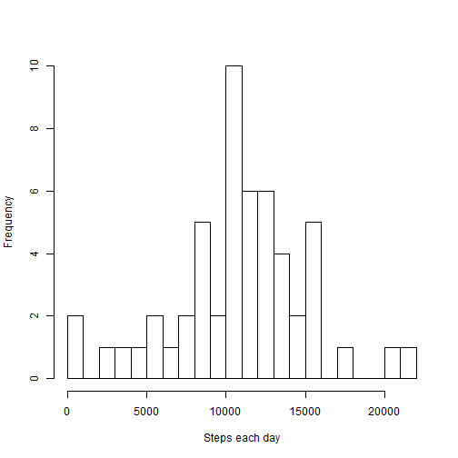
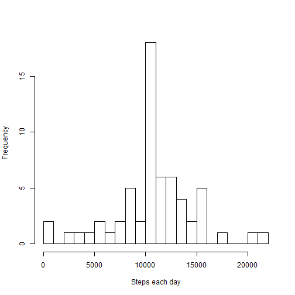
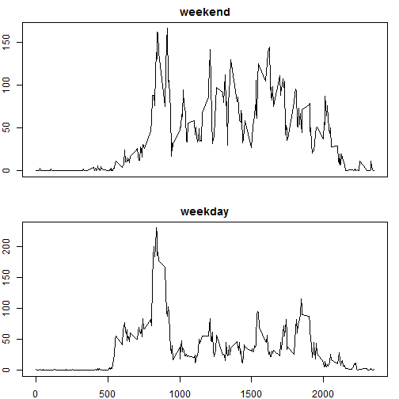

# Reproducible Research: Peer Assessment 1


## Loading and preprocessing the data


```r
activity <- read.csv("activity.csv")
stepsByDay <- aggregate(steps ~ date, activity, sum)
avgStepsByInterval <- aggregate(steps ~ interval, activity, mean)
```


## What is mean total number of steps taken per day?

### Histogram of the total number of steps taken each day


```r
hist(stepsByDay$steps, breaks = 20, main = "", xlab = "Steps each day")
```

 


### Mean total number of steps taken per day

```r
mean(stepsByDay$steps, na.rm = TRUE)
```

```
## [1] 10766
```


### Median total number of steps taken per day

```r
median(stepsByDay$steps, na.rm = TRUE)
```

```
## [1] 10765
```


## What is the average daily activity pattern?
### Time series plot

```r
plot(avgStepsByInterval, type = "l")
```

 

### The 5-minute interval that contains the maximum number of steps

```r
avgStepsByInterval[avgStepsByInterval$steps == max(avgStepsByInterval$steps), 
    ]$interval
```

```
## [1] 835
```


## Imputing missing values
### Number of missing values in the dataset

```r
sum(is.na(activity$steps))
```

```
## [1] 2304
```

### Filling in all of the missing values in the dataset

Devise a strategy for filling in all of the missing values in the dataset. Here the strategy is to use the mean for that 5-minute interval across all days.


```r
# Copy activities to new dataset
newdata <- activity
# Create replacement dataset
replacement <- rep(avgStepsByInterval$steps, 61)
# fill in missing values
newdata[is.na(activity$steps), ]$steps <- replacement[is.na(activity$steps)]
```

### Histogram of the total number of steps taken each day


```r
newStepsByDay <- aggregate(steps ~ date, newdata, sum)
hist(newStepsByDay$steps, breaks = 20, main = "", xlab = "Steps each day")
```

 


### Mean total number of steps taken per day

```r
mean(newStepsByDay$steps, na.rm = TRUE)
```

```
## [1] 10766
```


### Median total number of steps taken per day

```r
median(newStepsByDay$steps, na.rm = TRUE)
```

```
## [1] 10766
```


We can see that after imputing the missing data using the strategy mentioned above, the mean remains the same while median increases slightly.

## Are there differences in activity patterns between weekdays and weekends?


```r
library(chron)
weekendData <- newdata[is.weekend(newdata$date), ]
weekdayData <- newdata[!is.weekend(newdata$date), ]

weekendAvg <- aggregate(steps ~ interval, weekendData, mean)
weekdayAvg <- aggregate(steps ~ interval, weekdayData, mean)

par(mfrow = c(2, 1), mar = c(2, 2, 2, 1))
plot(weekendAvg, type = "l", xaxt = "n", xlab = "", main = "weekend")
plot(weekdayAvg, type = "l", xlab = "Interval", ylab = "Number of steps", main = "weekday")
```

 

